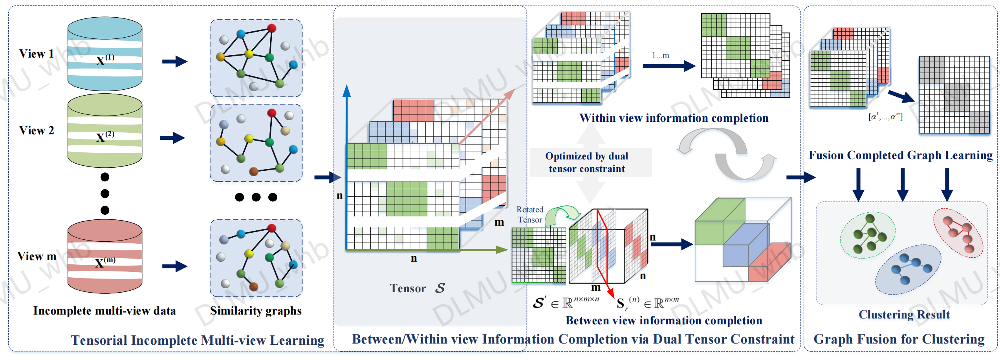

# BWIC-TIMC：Between/Within View Information Completing for Tensorial Incomplete Multi-view Clustering
 
### [Paper]()

This repository is the official code for the paper "Between/Within View Information Completing for Tensorial Incomplete Multi-view Clustering" by Mingze Yao(ymz0284@dlmu.edu.cn), Huibing Wang(huibing.wang@dlmu.edu.cn), Yawei Chen, Xianping Fu. lEEE Transactions on Multimedia 2024

## Introduction
In this paper, a novel Between/Within View Information Completing for Tensorial Incomplete Multi-view Clustering (BWIC-TIMC) has been proposed, in which between/within view information is jointly exploited for effectively completing the missing views. Specifically, the proposed method designs a dual tensor constraint module, which focuses on simultaneously exploring the view-specific correlations of incomplete views and enforcing the between view consistency across different views. With the dual tensor constraint, between/within view information can be effectively integrated for completing missing views for IMvC task. Furthermore, in order to balance different contributions of multiple views and alleviate the problem of feature degeneration, BWIC-TIMC implements an adaptive fusion graph learning strategy for consensus representation learning. 



## Dependencies
* OS: Windows 11
* Matlab2020b
* Related measure can be obtained in `.\Measure` and `.\tSVD` .

## Data Preparation
+ We have provided ORL dataset with 55\% missing ratio for instance, and the `ORL_fold_example.mat file` is provided to data preparation.
+ The natural incomplete 3sources can be obtained in `.\dataset`.
  
## Usage
+ Conduct clustering
  run  `demo_ORL.m`. The relevant hyperparameter settings have been provided in the code

##  Citation
If any part of our paper and repository is helpful to your work, please generously cite with:

```
@article{yao2024bwic-timc,
      title={Between/Within View Information Completing for Tensorial Incomplete Multi-view Clustering}, 
      author={ Mingze Yao, Huibing Wang, Yawei Chen, Xianping Fu},
      journal={IEEE Transactions on Multimedia}, 
      year={2024},
}
```
